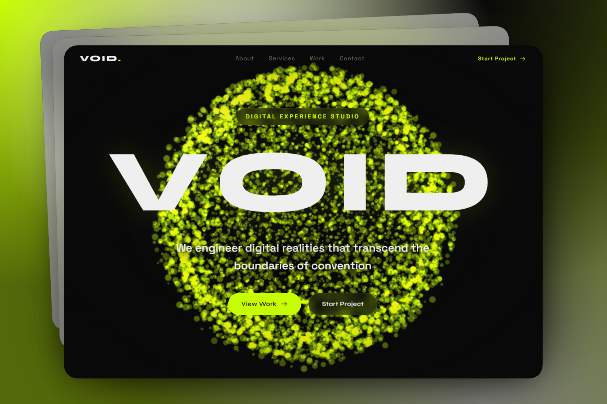

# VOID Studio Design

A modern portfolio landing page for VOID — a digital experience studio focused on immersive web, spatial computing, and real-time graphics.



## Project Overview

This repository contains a small static website built with HTML, CSS, and JavaScript. The homepage features:

- A full-screen animated hero section with custom WebGL particle effects
- Smooth scroll interactions and a responsive navigation bar
- Animated content reveals powered by GSAP and ScrollTrigger
- A modular capability, work, process, and contact layout
- A lightweight canvas-driven background and visual motion

## Tech Stack

- HTML5
- CSS3
- JavaScript
- GSAP (ScrollTrigger)
- Three.js (custom WebGL particle scene)
- Lenis smooth scrolling
- Iconify icons
- Google Fonts via CDN
- Tailwind CSS CDN utilities

## Project Structure

- `index.html` — main landing page markup
- `style.css` — visual design, layout, and responsive styles
- `script.js` — interactive animations, WebGL scene, and UI behavior

## Local Development

To preview the site locally:

```bash
cd /workspaces/void-studio-design
python3 -m http.server 8000
```

Then open `http://127.0.0.1:8000` in a browser.

## Lighthouse Analysis

A local Lighthouse audit was attempted for this project, but the development container currently lacks the needed Chrome/Chromium browser dependencies to launch the audit headlessly. The codebase is otherwise ready for standard Lighthouse evaluation in a Chrome-enabled environment.

### Audit notes and likely observations

- Performance: likely affected by external CDN scripts, large WebGL runtime, and third-party font loading. Deferring noncritical scripts and optimizing image delivery will help.
- Accessibility: the page already uses `lang="en"`, descriptive alt text, and semantic sections, but dynamic animation content should be verified for users with reduced motion and keyboard navigation.
- Best Practices: the site uses modern APIs and secure assets, but bundling and caching improvements could strengthen the audit score.
- SEO: strong on structure and metadata, though title and description can be expanded for a production-ready site.

### Recommended improvements

- Add a production-ready `meta description` and improved Open Graph tags
- Serve fonts and scripts from optimized bundles or a local build pipeline
- Compress large background images and use responsive image sets
- Consider a `prefetch`/`preload` strategy for fonts and critical assets
- Add a reduced-motion preference for users who disable animations

## Notes

This repository is a polished concept site for a design studio. It is ideal for deployment as a static landing page, and it can be enhanced further with a build step, asset optimization, or CMS integration.
